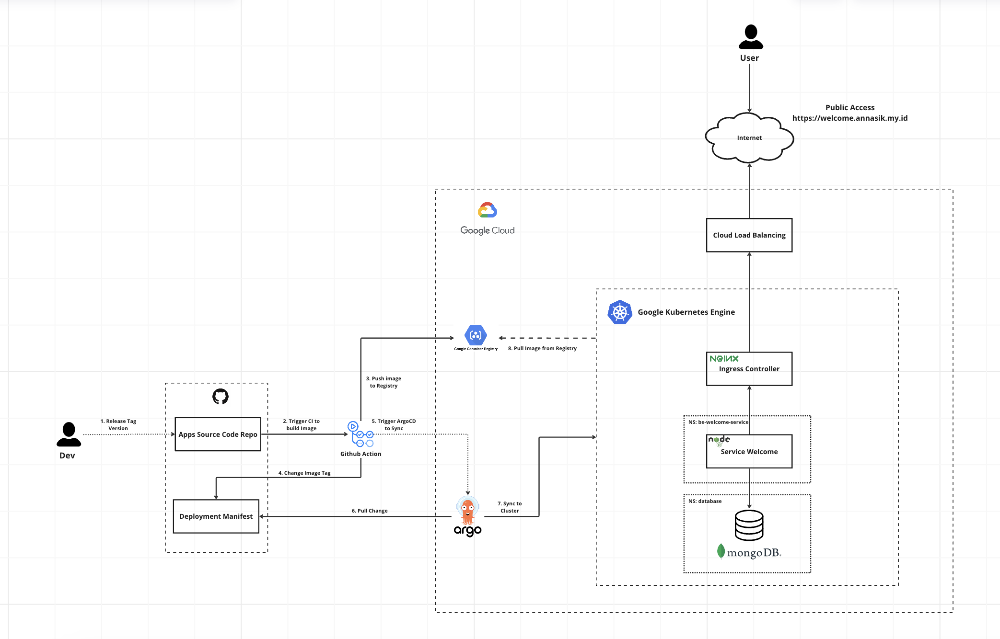

# DevOps Test Case SLTR

## Introduction

Repository ini merupakan mono repo yang dimana berisi simple apps RESTful API dan juga berisi semua manifest kubernetes yang digunakan untuk deploy aplikasi ini ke cluster kubernetes. Tujuan dari repository ini adalah untuk menjawab soal nomor 1 sampai 5 pada test case DevOps Engineer yang diberikan oleh SLTR.

## Table of Contents

- [Introduction](#introduction)
- [Tech Stack](#tech-stack)
- [Tasks](#tasks)
  - [Task 1: Simple Coding](#task-1-simple-coding)
  - [Task 2: Containerize - Docker](#task-2-containerize---docker)
  - [Task 3: CI/CD - Github Action](#task-3-cicd---github-action)
  - [Task 4: Kubernetes](#task-4-kubernetes)
  - [Task 5: Cloud Infra - GCP](#task-5-cloud-infra---gcp)
- [Solution](#solution)
  - [Task 1](#task-1)
  - [Task 2](#task-2)
  - [Task 3](#task-3)
  - [Task 4](#task-4)
  - [Task 5](#task-5)
- [Additional Documentation](#documentation)

## Tech Stack

- Kubernetes (k3s Self Hosted on Microcluster of Raspberry Pi 4 Model B)
- Docker Registry (https://hub.docker.com/u/nvlannasik)
- ArgoCD
- Github Actions
- NodeJS (ExpressJS)
- MongoDB
- Cloudflare
- Nginx Ingress Controller
- Cert Manager
- Longhorn
- MetalLB

## Task 1: Simple Coding

Buat sebuah aplikasi sederhana yang memiliki spesifikasi sebagai berikut:

- 1 route /welcome/{nama} , jika nama diisi maka akan menampilkan kata kata
  “Selamat datang {nama}” di browser, jika tidak tampilkan tulisan “Anonymous”
- Boleh menggunakan bahasa pemrograman apa saja
- Port untuk web server nya adalah port 5000

## Task 2: Containerize - Docker

- Dari soal nomer 1, silahkan dibuatkan image nya dengan tag localtesting/welcome. Silahkan tuliskan command untuk build image nya
- Command docker untuk build image sesuai permintaan diatas.
- Command docker run untuk image diatas, dengan menggunakan port 8000 sebagai port yang akan dibuka
- Buat Docker Compose file untuk menjalankan image diatas, dengan menggunakan port 8000 sebagai port yang akan dibuka

## Task 3: CI/CD - Github Action

- Buat tag release di github (contoh v1.0.0)
- Script dapat dijalankan manual (workflow_dispatch) dengan memilih tag release untuk branch yang akan di build & deploy
- Build Code di point 1 menjadi docker image dengan tag latest & tag release github . (contoh testing/welcome:latest & testing welcome:1.0.0)
- Push docker image tersebut ke docker registry public yang free dan bisa diakses secara public

## Task 4: Kubernetes

Silahkan buatkan script yaml untuk image yang sudah di build diatas dengan spesifikasi sebagai berikut:

- ConfigMap & Secret Script
- Deployment Script
- Service Script
- Ingress Script

## Task 5: Cloud Infra - GCP

Silahkan dibuatkan High Level Architecture diagramnya (gambar) dengan keterangan yang dibutuhkan jika poin 1 dan 4 akan di deploy ke Google Cloud Provider

## Solution

### Task 1

Clone this repository

```bash
git clone https://github.com/nvlannasik/devops-sltr-test-case.git
```

Go to the project directory

```
cd App/
```

Install dependencies

```
npm install
```

input configuration in .env file

```
PORT=5000
NODE_ENV=test
```

Start the server

```
npm start
```

Test the server

```
curl -X GET http://localhost:5000/welcome/John
```

### Task 2

Go to the project directory

```
cd App/
```

Build the image

```
docker build -t localtesting/welcome .
```

Run the image

```
docker run -dp 8000:5000 localtesting/welcome
```

Run the image with docker compose

```
docker-compose up -d
```

### Task 3

CI/CD workflow didefinisikan didalam file `.github/workflows/main.yml`. Workflow ini akan di trigger ketika ada push tag baru ke repository ini atau ketika workflow di trigger secara manual. Workflow ini akan melakukan build image dan push image ke docker hub. Lalu akan melakukan update manifest kubernetes dengan image tag yang baru. Setelah itu ArgoCD akan melakukan sync dengan repository ini dan melakukan rolling update ke deployment yang ada di cluster kubernetes.

Untuk arsitektur CI/CD workflow yang diimplementasikan saat ini bisa dilihat pada gambar berikut:


Dan untuk image registry yang digunakan adalah docker hub dengan link berikut:
https://hub.docker.com/r/nvlannasik/welcome

### Task 4

Semua manifest berada di folder `Manifest/`. Manifest Deployment akan di update oleh github action ketika terjadi push tag baru ke repository ini. Dan ArgoCD akan melakukan sync dengan repository ini dan melakukan rolling update ke deployment yang ada di cluster kubernetes.

### Task 5

Untuk High Level Architecture diagram pada task 1 dan 4 jika ingin di deploy ke Google Cloud Provider, sebenarnya tidak jauh berbeda dengan arsitektur yang sudah diimplementasikan saat ini. Hanya saja untuk image registry akan diganti dengan **Google Container Registry (GCR)**. Dan untuk deployment kubernetes akan diganti dengan **Google Kubernetes Engine (GKE)**. Ditambah dengan **Cloud Load Balancer** untuk menghandle traffic dari luar cluster dan mendapatkan IP Public yang bisa diakses dari luar cluster. Untuk DNS management bisa menggunakan **Cloud DNS** atau bisa juga menggunakan DNS dari provider lain seperti **Cloudflare**.



## Additional Technical Documentation

- [Setup Kubernetes Cluster on Raspberry Pi 4 Model B](https://github.com/nvlannasik/microcluster-k3s-documentation)
- [API Access Endpoint](https://welcome.annasik.my.id/welcome)
- [Mono Repo With 3 Apps](https://github.com/nvlannasik/devops-usecase)

## Author

- [Ahmad Naoval Annasik](https://github.com/nvlannasik)
